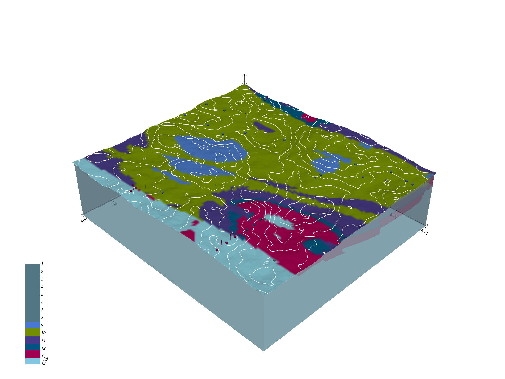

# 

> Open-source, implicit 3D structural geological modeling in Python.

## Overview

[GemPy](https://www.gempy.org/) is a Python-based, **open-source geomodeling library**. It is
capable of constructing complex **3D geological models** of folded
structures, fault networks and unconformities, based on the underlying
powerful **implicit representation** approach. 

## Installation

We provide the latest release version of GemPy via PyPi package services. We highly recommend using PyPi,

`$ pip install gempy`

as it will take care of automatically installing all the required dependencies - except in windows that requires one extra step.

Windows does not have a gcc compilers pre-installed. The easiest way to get a theano compatible compiler is by using 
the theano conda installation. Therefore the process would be the following:

`$ conda install theano`

`$ pip install gempy`

For more information, refer to the [installation documentation](https://docs.gempy.org/installation.html)

## Resources

After installation you can either check the [Notebook tutorials](https://docs.gempy.org/getting_started/get_started.html#sphx-glr-getting-started-get-started-py) 
or the [video introduction](https://www.youtube.com/watch?v=n0btC5Zilyc) to get started.

Check the [documentation site](http://docs.gempy.org/) for further information and enjoy the [tutorials and examples](https://www.gempy.org/tutorials).

For questions and support, please use [discussions](https://github.com/cgre-aachen/gempy/discussions).

If you find a bug or have a feature request, create an [issue](https://github.com/cgre-aachen/gempy/issues).

## References 

* de la Varga, M., Schaaf, A., and Wellmann, F.: GemPy 1.0: open-source stochastic geological modeling and inversion, Geosci. Model Dev., 12, 1-32, https://doi.org/10.5194/gmd-12-1-2019, 2019
* Calcagno, P., Chilès, J. P., Courrioux, G., & Guillen, A. (2008). Geological modelling from field data and geological knowledge: Part I. Modelling method coupling 3D potential-field interpolation and geological rules. Physics of the Earth and Planetary Interiors, 171(1-4), 147-157.
* Lajaunie, C., Courrioux, G., & Manuel, L. (1997). Foliation fields and 3D cartography in geology: principles of a method based on potential interpolation. Mathematical Geology, 29(4), 571-584.

## Publications using GemPy

* Wellmann, F., Schaaf, A., de la Varga, M., & von Hagke, C. (2019). [From Google Earth to 3D Geology Problem 2: Seeing Below the Surface of the Digital Earth](
https://www.sciencedirect.com/science/article/pii/B9780128140482000156).
In Developments in Structural Geology and Tectonics (Vol. 5, pp. 189-204). Elsevier.
* add other papers
