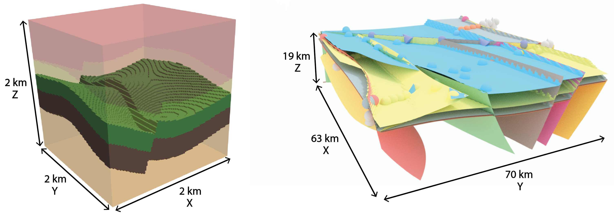

# 

> Open-source, implicit 3D structural geological modeling in Python for uncertainty analysis.

## What is it

*GemPy* is a Python-based, open-source library for **implicitly generating 3D structural geological models**. It is capable of
constructing complex 3D geological models of folded structures, fault networks and unconformities. It was designed from the 
ground up to support easy embedding in probabilistic frameworks for the uncertainty analysis of subsurface structures.

Check out the documentation either in [gempy.org](https://www.gempy.org/) (better option), or [read the docs](http://gempy.readthedocs.io/).

## Table of Contents

* [Features](#feat)
    * [Sandbox](#sandbox)
    * [Remote Geomod](#remotegeo)
* [Getting Started](#getstart)
    * [Dependencies](#depend)
    * [Installation](#installation)
* [Documentation](#doc)
* [References](#ref)

## News
### GemPy v2.0 beta release

It has been a long journey since the release of GemPy v1.0. What started as a small library to carry out research
on uncertainty analysis for structural geology has grown to be used in multiple projects around the world. Carried
by the community enthusiasm, we commenced a way-longer-than-planned rewritten of the code in order to
not only be able to fulfill the needs of many of you but also to set the foundations of a package driven by the
community. For this end, all the logic has been splat into multiple modules, classes and containers limiting
duplicities and exposing a large mutation api at different levels of abstraction. Hope the work has been worth it.

So long,

Miguel

#### What is new
- Full redesign of the back-end: much more modular, explicit and avoiding object duplicities to insane levels
- Topography
- Onlap, Erosion relations
- Choose your favourite type of fault: infinite faults, finite faults, faults offsetting faults, faults ending on series
- Masked marching cubes: this fix the ugly surfaces following the voxels faces
- All series are fully stored after interpolation
- Save your model
- Compile once, modify as much as you want
- Full integration with qgrid
- Real time computations via vtk or python-qgrid
- Adaptive regular grids for geophysics
- Refactored some legacy names:
    + formations renamed to surfaces
    + interfaces renamed to surfaces_points
- Minor changes:
    + New colormap and easy way to change the surfaces colors (even integration with widgets!)
    + The order of the formations will be given by the interpolation itself if the input was wrong
    + The split between reference and rest surface_points happens in theano. This makes much easier the modification
    of reference points

## Features

The core algorithm of *GemPy* is based on a universal cokriging interpolation method devised by
Lajaunie et al. (1997) and extended by Calcagno et al. (2008). Its implicit nature allows the user to automatically
generate complex 3D structural geological models through the interpolation of input data:

- *Surface contact points*: 3D coordinates of points marking the boundaries between different features (e.g. layer interfaces, fault planes, unconformities).
- *Orientation measurements*: Orientation of the poles perpendicular to the dipping of surfaces at any point in the 3D space.

*GemPy* also allows for the definition of topological elements such as combining multiple stratigraphic sequences and 
complex fault networks to be considered in the modeling process.

*GemPy* itself offers direct visualization of 2D model sections via matplotlib
and in full, interactive 3D using the Visualization Toolkit (VTK). The VTK support also allow to the real time maniulation
of the 3-D model, allowing for the exact modification of data. Models can also easily be exportes in VTK file format
for further visualization and processing in other software such as ParaView.

*GemPy* was designed from the beginning to support stochastic geological modeling for uncertainty analysis (e.g. Monte Carlo simulations, Bayesian inference). This was achieved by writing *GemPy*'s core architecture
using the numerical computation library [Theano](http://deeplearning.net/software/theano/) to couple it with the probabilistic programming framework [PyMC3](https://pymc-devs.github.io/pymc3/notebooks/getting_started.html).
This enables the use of advanced sampling methods (e.g. Hamiltonian Monte Carlo) and is of particular relevance when considering
uncertainties in the model input data and making use of additional secondary information in a Bayesian inference framework.

We can, for example, include uncertainties with respect to the z-position of layer boundaries
in the model space. Simple Monte Carlo simulation via PyMC will then result in different model realizations:

 

Theano allows the automated computation of gradients opening the door to the use of advanced gradient-based sampling methods
coupling *GeMpy* and [PyMC3](https://pymc-devs.github.io/pymc3/notebooks/getting_started.html) for advanced stochastic modeling.
Also, the use of Theano allows making use of GPUs through cuda (see the Theano documentation for more information.

Making use of vtk interactivity and Qgrid (https://github.com/quantopian/qgrid) *GemPy* provides a functional interface to interact with input data and models.

For a more detailed elaboration of the theory behind *GemPy*, take a look at the upcoming scientific publication
*"GemPy 1.0: open-source stochastic geological modeling and inversion"* by de la Varga et al. (2018).

Besides the main functionality GemPy is powering currently some further projects:

### Sandbox

New developments in the field of augmented reality, i.e. the superimposition of real and digital objects, offer interesting and diverse possibilities that have hardly been exploited to date.
The aim of the project is therefore the development and realization of an augmented reality sandbox for interaction with geoscientific data and models.
In this project, methods are to be developed to project geoscientific data (such as the outcrop of a geological layer surface or geophysical measurement data) onto real surfaces.

The AR Sandbox is based on a container filled with sand, the surface of which can be shaped as required. The topography of the sand surface is continuously scanned by a 3D sensor and a camera.
In the computer the scanned surface is now blended with a digital geological 3D model (or other data) in real time and an image is calculated, which is projected onto the sand surface by means
of a beamer. This results in an interactive model with which the user can interact in an intuitive way and which visualizes and comprehend complex three-dimensional facts in an accessible way.

In addition to applications in teaching and research, this development offers great potential as an interactive exhibit with high outreach for the geosciences thanks to its intuitive operation.
The finished sandbox can be used in numerous lectures and public events , but is mainly used as an interface to GemPy software and for rapid prototyping of implicit geological models.

<a href="https://youtu.be/oE3Atw-YvSA">

### Remote Geomod: From GoogleEarth to 3-D Geology

We support this effort here with a full 3-D geomodeling exercise
on the basis of the excellent possibilities offered by open global data sets, implemented in
GoogleEarth, and dedicated geoscientific open-source software and motivate the use of 3-D
geomodeling to address specific geological questions. Initial steps include the selection of
relevant geological surfaces in GoogleEarth and the analysis of determined orientation values
for a selected region This information is subsequently used
to construct a full 3-D geological model with a state-of-the-art interpolation algorithm. Fi-
nally, the generated model is intersected with a digital elevation model to obtain a geological
map, which can then be reimported into GoogleEarth.

## Getting Started

### Dependencies

*GemPy* requires Python 3 and makes use of numerous open-source libraries:

* pandas>=0.21.0
* cython
* Theano
* matplotlib
* numpy
* pytest
* nbsphinx
* seaborn
* networkx
* ipywidgets

Optional:

* git+git://github.com/Leguark/scikit-image@master
* steno3d
* vtk
* gdal
* qgrid
* pymc
* pymc3

* `vtk>=7` for interactive 3-D visualization 
* `pymc` or `pymc3`
* `steno3d` 

Overall we recommend the use of a dedicated Python distribution, such as 
[Anaconda](https://www.continuum.io/what-is-anaconda), for hassle-free package installation. 
We are currently working on providing GemPy also via Anaconda Cloud, for easier installation of
its dependencies.

#### Conflictive packages.

Installing Theano (specially in windows) and vtk sometimes is problematic. Here we give a few advices that
usually works for us:
* Theano: install the following packages before installing theano: `conda install mingw libpython m2w64-toolchain`. Then install Theano via `conda install theano`. 
If the installation fails at some point try to re-install anaconda for a single user (no administrator priveleges) and with the Path Environment set.
To use Theano with `numpy version 1.16.0` or following, it has to be updated to `Theano 1.0.4` using `pip install theano --upgrade`.
Note that this is not yet available in the conda package manager.

* scikit_image (Spring 2019): To use scikit_image with `numpy version 1.16.0` or following, it has to be updated to `scikit_image 1.14.2` using `pip install scikit_image --upgrade`.
Note that this is not yet available in the conda package manager.

* vtk: Right now (Fall 2018), does not have compatibility with python 3.7. The simplest solution to install it is to
use `conda install python=3.6` to downgrade the python version and then using `pip install vtk`.

### Installation

We provide the latest release version of *GemPy* via the **Conda** and **PyPi** package services. We highly
recommend using either PyPi as it will take care of automatically installing all dependencies.

#### PyPi 

`$ pip install gempy`

#### New in GemPy 2.0: Docker image

Finally e also provide precompiled Docker images hosted on Docker Hub with all necessary dependencies to get 
GemPy up and running (**except vtk**).

ocker is an operating-system-level-visualization software,
meaning that we can package a tiny operating system with pre-installed
software into a Docker image. This Docker image can then be shared
with and run by others, enabling them to use intricate dependencies
with just a few commands. For this to work the user needs to have a
working [Docker](https://www.docker.com/) installation.

##### Pull Docker image from DockerHub

The easiest way to get remote-geomod running is by running the pre-compiled Docker image (containing everything you
need) directly from the cloud service Docker Hub to get a locally running Docker container. Make sure to set your 
Docker daemon to Linux containers in Docker's context menu.

    $ docker run -it -p 8899:8899 leguark/gempy
    
This will automatically pull the Docker image from Docker Hub and run it, opening a command line shell inside of the
running Docker container. There you have access to the file system inside of the container. Note that this pre-compiled
Docker image already contains the GemPy repository. 

Once you are in the docker console if you want to open the tutorials you will need to run:

    $ jupyter notebook --ip 0.0.0.0 --port 8899 --no-browser --allow-root
     
Notice that we are running the notebook on the port  8899 to try to avoid conflicts with jupyter servers running in
your system. If everything worked fine, the address to the jupyter notebook will be display on the console. It
has to look something like this (Just be aware of the  brackets):

    To access the notebook, open this file in a browser:
            file:///root/.local/share/jupyter/runtime/nbserver-286-open.html
    Or copy and paste one of these URLs:
        http://(ce2cdcc55bb0 or 127.0.0.1):8899/?token=97d52c1dc321c42083d8c1b4d

#### Manual

Otherwise you can clone the current repository by downloading is manually or by using Git by calling

`$ git clone https://github.com/cgre-aachen/gempy.git`

and then manually install it using the provided Python install file by calling

`$ python gempy/setup.py install`

in the cloned or downloaded repository folder. Make sure you have installed all necessary dependencies listed above before using *GemPy*.

##### Windows installation guide (Jun 2019)

1) Install CUDA if you do not have it already.

2) Install Anaconda3 2019.03 with Python 3.7 (this is the last release).

3) Install Theano and associated packages from the Anaconda prompt as administrator, and finally install GemPy 2.0:

- conda update --all
- conda install libpython
- conda install m2w64-toolchain
- conda install git
- conda install pygpu
- pip install theano==1.0.4
- pip install gempy==2.0b0.dev2

Note that:

a) some other packages required by Theano are already included in Anaconda: numpy, scipy, mkl-service, nose, and sphinx.

b) pydot-ng (suggested on Theano web site) yields a lot of errors. I dropped this. It is needed to handle large picture for gif/images and probably it is not needed by GemPy.

c) Trying to install all the packages in one go but it does not work, as well as doing the same in Anaconda Navigator, or installing an older Anaconda release with Python 3.5 (Anaconda3 4.2.0) as indicated in some tutorial on Theano.

## Documentation

Extensive documentation for *GemPy* is hosted at [gempy.readthedocs.io](http://gempy.readthedocs.io/),
explaining its capabilities, [the theory behind it](http://gempy.readthedocs.io/Kriging.html) and 
providing detailed [tutorials](http://gempy.readthedocs.io/tutorial.html) on how to use it.

## References

* de la Varga, M., Schaaf, A., and Wellmann, F.: GemPy 1.0: open-source stochastic geological modeling and inversion, Geosci. Model Dev., 12, 1-32, https://doi.org/10.5194/gmd-12-1-2019, 2019
* Calcagno, P., Chilès, J. P., Courrioux, G., & Guillen, A. (2008). Geological modelling from field data and geological knowledge: Part I. Modelling method coupling 3D potential-field interpolation and geological rules. Physics of the Earth and Planetary Interiors, 171(1-4), 147-157.
* Lajaunie, C., Courrioux, G., & Manuel, L. (1997). Foliation fields and 3D cartography in geology: principles of a method based on potential interpolation. Mathematical Geology, 29(4), 571-584.
