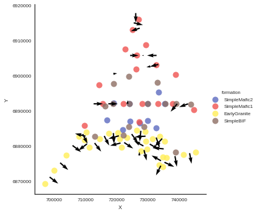
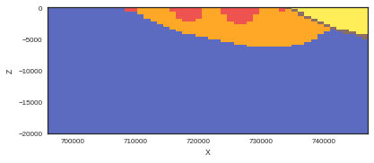
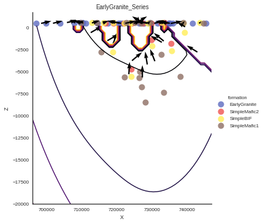

Chapter 2: A real example. Importing data and setting series
============================================================

Data Management
---------------

In this example we will show how we can import data from a csv and
generate a model with several depositional series.

.. code:: ipython3

    # These two lines are necessary only if gempy is not installed
    import sys, os
    sys.path.append("../")
    
    # Importing gempy
    import gempy as gp
    
    # Embedding matplotlib figures into the notebooks
    %matplotlib inline
    
    # Aux imports
    import numpy as np

In this case instead loading a geo\_data object directly, we will create
one. The main atributes we need to pass are: - Extent: X min, X max, Y
min, Y max, Z min, Z max - Resolution: X,Y,Z

Additionaly we can pass the address to csv files (GeoModeller3D format)
with the data.

.. code:: ipython3

    # Importing the data from csv files and settign extent and resolution
    geo_data = gp.create_data([696000,747000,6863000,6950000,-20000, 200],[50, 50, 50],
                             path_f = os.pardir+"/input_data/a_Foliations.csv",
                             path_i = os.pardir+"/input_data/a_Points.csv")
    
    gp.get_raw_data(geo_data, 'interfaces').head()

.. raw:: html

    

    
    <table border="1" class="dataframe">
      <thead>
        <tr style="text-align: right;">
          <th></th>
          <th>X</th>
          <th>Y</th>
          <th>Z</th>
          <th>formation</th>
          <th>series</th>
          <th>order_series</th>
        </tr>
      </thead>
      <tbody>
        <tr>
          <th>0</th>
          <td>735484.817806</td>
          <td>6.891936e+06</td>
          <td>-1819.319309</td>
          <td>SimpleMafic2</td>
          <td>Default serie</td>
          <td>1</td>
        </tr>
        <tr>
          <th>1</th>
          <td>722693.188000</td>
          <td>6.907492e+06</td>
          <td>555.452867</td>
          <td>SimpleMafic1</td>
          <td>Default serie</td>
          <td>1</td>
        </tr>
        <tr>
          <th>2</th>
          <td>725092.188000</td>
          <td>6.913005e+06</td>
          <td>514.864987</td>
          <td>SimpleMafic1</td>
          <td>Default serie</td>
          <td>1</td>
        </tr>
        <tr>
          <th>3</th>
          <td>744692.688000</td>
          <td>6.890291e+06</td>
          <td>496.019711</td>
          <td>SimpleMafic1</td>
          <td>Default serie</td>
          <td>1</td>
        </tr>
        <tr>
          <th>4</th>
          <td>738924.813000</td>
          <td>6.900194e+06</td>
          <td>551.633725</td>
          <td>SimpleMafic1</td>
          <td>Default serie</td>
          <td>1</td>
        </tr>
      </tbody>
    </table>
    

You can visualize the points in 3D (work in progress)

.. code:: ipython3

    gp.plot_data_3D(geo_data)

.. parsed-literal::

    739426.6276840001 6891935.451483999 75.422691
    739426.6276840001 6891935.451483999 75.422691
    739426.6276840001 6891935.451483999 75.422691
    739426.6276840001 6891935.451483999 75.422691
    732683.469 6882332.75 481.71195199999994
    732683.469 6882332.75 481.71195199999994
    732683.469 6882332.75 481.71195199999994
    732683.469 6882332.75 481.71195199999994
    730627.5315 6880472.5 477.40265800000003
    730627.5315 6880472.5 477.40265800000003
    730627.5315 6880472.5 477.40265800000003
    730627.5315 6880472.5 477.40265800000003
    728767.4065 6878759.25 470.031623
    728767.4065 6878759.25 470.031623
    728767.4065 6878759.25 470.031623
    728767.4065 6878759.25 470.031623
    728571.594 6879934.25 472.536776
    728571.594 6879934.25 472.536776
    728571.594 6879934.25 472.536776
    728571.594 6879934.25 472.536776
    729256.9065 6882724.5 471.72292400000003
    729256.9065 6882724.5 471.72292400000003
    729256.9065 6882724.5 471.72292400000003
    729256.9065 6882724.5 471.72292400000003
    727739.4375 6884242.0 474.25872599999997
    727739.4375 6884242.0 474.25872599999997
    727739.4375 6884242.0 474.25872599999997
    727739.4375 6884242.0 474.25872599999997
    724802.4065 6883312.0 473.707869
    724802.4065 6883312.0 473.707869
    724802.4065 6883312.0 473.707869
    724802.4065 6883312.0 473.707869
    722403.813 6880913.25 470.70706500000006
    722403.813 6880913.25 470.70706500000006
    722403.813 6880913.25 470.70706500000006
    722403.813 6880913.25 470.70706500000006
    721229.0005 6880766.25 477.680894
    721229.0005 6880766.25 477.680894
    721229.0005 6880766.25 477.680894
    721229.0005 6880766.25 477.680894
    720690.563 6882822.25 489.90942300000006
    720690.563 6882822.25 489.90942300000006
    720690.563 6882822.25 489.90942300000006
    720690.563 6882822.25 489.90942300000006
    718928.344 6883605.5 509.462245
    718928.344 6883605.5 509.462245
    718928.344 6883605.5 509.462245
    718928.344 6883605.5 509.462245
    715991.2815 6882773.25 505.16586399999994
    715991.2815 6882773.25 505.16586399999994
    715991.2815 6882773.25 505.16586399999994
    715991.2815 6882773.25 505.16586399999994
    712907.3755 6880766.25 512.582136
    712907.3755 6880766.25 512.582136
    712907.3755 6880766.25 512.582136
    712907.3755 6880766.25 512.582136
    710459.844 6880521.5 511.839758
    710459.844 6880521.5 511.839758
    710459.844 6880521.5 511.839758
    710459.844 6880521.5 511.839758
    709970.344 6882724.5 532.9679150000001
    709970.344 6882724.5 532.9679150000001
    709970.344 6882724.5 532.9679150000001
    709970.344 6882724.5 532.9679150000001
    709089.2505 6883312.0 519.457428
    709089.2505 6883312.0 519.457428
    709089.2505 6883312.0 519.457428
    709089.2505 6883312.0 519.457428
    705858.5005 6880032.25 494.307044
    705858.5005 6880032.25 494.307044
    705858.5005 6880032.25 494.307044
    705858.5005 6880032.25 494.307044
    734592.563 6882039.25 487.287083
    734592.563 6882039.25 487.287083
    734592.563 6882039.25 487.287083
    734592.563 6882039.25 487.287083
    701844.5315 6875137.25 476.658525
    701844.5315 6875137.25 476.658525
    701844.5315 6875137.25 476.658525
    701844.5315 6875137.25 476.658525
    735082.063 6879102.25 480.551436
    735082.063 6879102.25 480.551436
    735082.063 6879102.25 480.551436
    735082.063 6879102.25 480.551436
    734151.969 6874304.75 448.179887
    734151.969 6874304.75 448.179887
    734151.969 6874304.75 448.179887
    734151.969 6874304.75 448.179887
    717311.112372 6891940.971392999 -1497.488309
    717311.112372 6891940.971392999 -1497.488309
    717311.112372 6891940.971392999 -1497.488309
    717311.112372 6891940.971392999 -1497.488309
    723415.321182 6891939.447817 -5298.1543090000005
    723415.321182 6891939.447817 -5298.1543090000005
    723415.321182 6891939.447817 -5298.1543090000005
    723415.321182 6891939.447817 -5298.1543090000005
    742907.686575 6891934.582632001 -2786.869309
    742907.686575 6891934.582632001 -2786.869309
    742907.686575 6891934.582632001 -2786.869309
    742907.686575 6891934.582632001 -2786.869309
    712584.536312 6891942.15112 -582.769334
    712584.536312 6891942.15112 -582.769334
    712584.536312 6891942.15112 -582.769334
    712584.536312 6891942.15112 -582.769334
    724309.279198 6905712.031145 -3763.8629950000004
    724309.279198 6905712.031145 -3763.8629950000004
    724309.279198 6905712.031145 -3763.8629950000004
    724309.279198 6905712.031145 -3763.8629950000004
    728653.9332569999 6905714.891064 -4196.807995
    728653.9332569999 6905714.891064 -4196.807995
    728653.9332569999 6905714.891064 -4196.807995
    728653.9332569999 6905714.891064 -4196.807995
    732788.182361 6905717.612482001 -1680.306995
    732788.182361 6905717.612482001 -1680.306995
    732788.182361 6905717.612482001 -1680.306995
    732788.182361 6905717.612482001 -1680.306995
    727261.874621 6877214.496202 -5666.992176
    727261.874621 6877214.496202 -5666.992176
    727261.874621 6877214.496202 -5666.992176
    727261.874621 6877214.496202 -5666.992176
    718902.5312979999 6900478.748653 -1882.8952969999998
    718902.5312979999 6900478.748653 -1882.8952969999998
    718902.5312979999 6900478.748653 -1882.8952969999998
    718902.5312979999 6900478.748653 -1882.8952969999998
    733335.732778 6903150.931884 -1538.6292970000002
    733335.732778 6903150.931884 -1538.6292970000002
    733335.732778 6903150.931884 -1538.6292970000002
    733335.732778 6903150.931884 -1538.6292970000002
    730820.452963 6902599.428688001 -3825.776297
    730820.452963 6902599.428688001 -3825.776297
    730820.452963 6902599.428688001 -3825.776297
    730820.452963 6902599.428688001 -3825.776297
    725461.656 6915002.0 510.686328
    725461.656 6915002.0 510.686328
    725461.656 6915002.0 510.686328
    725461.656 6915002.0 510.686328
    726102.312 6917775.5 499.040304
    726102.312 6917775.5 499.040304
    726102.312 6917775.5 499.040304
    726102.312 6917775.5 499.040304
    727390.156 6913486.75 517.5692429999999
    727390.156 6913486.75 517.5692429999999
    727390.156 6913486.75 517.5692429999999
    727390.156 6913486.75 517.5692429999999
    743403.6875 6877878.25 454.74995199999995
    743403.6875 6877878.25 454.74995199999995
    743403.6875 6877878.25 454.74995199999995
    743403.6875 6877878.25 454.74995199999995
    738704.4065 6877046.0 458.14874000000003
    738704.4065 6877046.0 458.14874000000003
    738704.4065 6877046.0 458.14874000000003
    738704.4065 6877046.0 458.14874000000003
    735326.7815 6875283.75 452.96645599999994
    735326.7815 6875283.75 452.96645599999994
    735326.7815 6875283.75 452.96645599999994
    735326.7815 6875283.75 452.96645599999994
    734200.938 6875724.5 461.98580400000003
    734200.938 6875724.5 461.98580400000003
    734200.938 6875724.5 461.98580400000003
    734200.938 6875724.5 461.98580400000003
    698466.9375 6871074.25 463.972201
    698466.9375 6871074.25 463.972201
    698466.9375 6871074.25 463.972201
    698466.9375 6871074.25 463.972201

Or a projection in 2D:

.. code:: ipython3

    gp.plot_data(geo_data, direction='z')

.. parsed-literal::

    <gempy.Visualization.PlotData2D at 0x7fce1b47be10>

This model consist in 3 different depositional series. This mean that
only data in the same depositional series affect the interpolation. To
select with formations belong to witch series we will use the
``set_data_series`` function which takes a python dictionary as input.

We can see the unique formations with:

.. code:: ipython3

    gp.get_series(geo_data)

.. raw:: html

    

    
    <table border="1" class="dataframe">
      <thead>
        <tr style="text-align: right;">
          <th></th>
          <th>Default serie</th>
        </tr>
      </thead>
      <tbody>
        <tr>
          <th>0</th>
          <td>SimpleMafic2</td>
        </tr>
        <tr>
          <th>1</th>
          <td>SimpleBIF</td>
        </tr>
        <tr>
          <th>2</th>
          <td>SimpleMafic1</td>
        </tr>
        <tr>
          <th>3</th>
          <td>EarlyGranite</td>
        </tr>
      </tbody>
    </table>
    

Setting the series we also give the specific order of the series. In
python 3.6 and above the dictionaries conserve the key order so it is
not necessary to give explicitly the order of the series.

Notice as well that the order of the formations within each series is
not relevant for the result but in case of being wrong can lead to
confusing color coding (work in progress).

In the representation given by ``get_series`` the elements get repeated
but is only how Pandas print tables.

.. code:: ipython3

    # Assigning series to formations as well as their order (timewise)
    gp.set_data_series(geo_data, {"EarlyGranite_Series": 'EarlyGranite', 
                                  "BIF_Series":('SimpleMafic2', 'SimpleBIF'),
                                  "SimpleMafic_Series":'SimpleMafic1'}, 
                          order_series = ["EarlyGranite_Series",
                                          "BIF_Series",
                                          "SimpleMafic_Series"], verbose=1)

.. raw:: html

    

    
    <table border="1" class="dataframe">
      <thead>
        <tr style="text-align: right;">
          <th></th>
          <th>EarlyGranite_Series</th>
          <th>BIF_Series</th>
          <th>SimpleMafic_Series</th>
        </tr>
      </thead>
      <tbody>
        <tr>
          <th>0</th>
          <td>EarlyGranite</td>
          <td>SimpleMafic2</td>
          <td>SimpleMafic1</td>
        </tr>
        <tr>
          <th>1</th>
          <td>EarlyGranite</td>
          <td>SimpleBIF</td>
          <td>SimpleMafic1</td>
        </tr>
      </tbody>
    </table>
    

Computing the model
-------------------

Now as in the previous chapter we just need to create the interpolator
object and compute the model.

.. code:: ipython3

    interp_data = gp.InterpolatorInput(geo_data)

.. parsed-literal::

    [2, 2]

.. code:: ipython3

    sol = gp.compute_model(interp_data)

.. parsed-literal::

    [9 9 9]

.. parsed-literal::

    /home/miguel/anaconda3/lib/python3.6/site-packages/scipy/linalg/basic.py:223: RuntimeWarning: scipy.linalg.solve
    Ill-conditioned matrix detected. Result is not guaranteed to be accurate.
    Reciprocal condition number: 2.402444465587905e-08
      ' condition number: {}'.format(rcond), RuntimeWarning)

Now if we analyse the results we have a 3D array where the axis 0
represent the superposition of the series (potential fields). The color
coding is working process yet.

.. code:: ipython3

    import matplotlib.pyplot as plt
    gp.plot_section(geo_data, sol[0,0,:], 11)
    plt.show()
    gp.plot_section(geo_data, sol[1,0,:], 11)
    plt.show()
    gp.plot_section(geo_data, sol[2,0,:], 11)
    plt.show()

.. image:: ch2_files/ch2_17_0.png

.. image:: ch2_files/ch2_17_1.png

The axis 1 keeps the potential field:

.. code:: ipython3

    gp.plot_potential_field(geo_data, sol[0,1,:], 11, cmap='inferno_r')
    plt.show()
    gp.plot_potential_field(geo_data, sol[1,1,:], 11, cmap='inferno_r')
    plt.show()
    gp.plot_potential_field(geo_data, sol[2,1,:], 11, cmap='inferno_r')
    plt.show()

.. image:: ch2_files/ch2_19_0.png

.. image:: ch2_files/ch2_19_1.png

And the axis 2 keeps the faults network that in this model since there
is not faults does not represent anything.

Additionally with can export the blocks to vtk in order to visualize
them in Paraview. We are working in visualization in place as well.

.. code:: ipython3

    gp.export_vtk_rectilinear(geo_data, sol[-1, 0, :], path=None)
