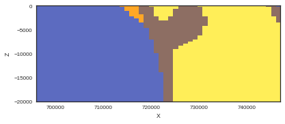
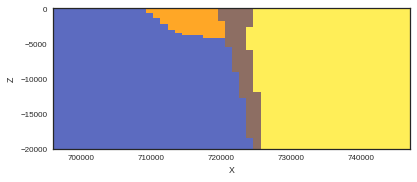
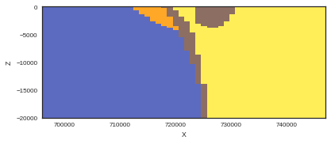

Chapter 4: Bayesian Statistics in pymc3 (Working in progress proof of concept)
==============================================================================

.. code:: ipython3

    # These two lines are necessary only if gempy is not installed
    import sys, os
    sys.path.append("../")
    
    # Importing gempy
    import gempy as gp
    
    # Embedding matplotlib figures into the notebooks
    %matplotlib inline
    
    # Aux imports
    import numpy as np

.. code:: ipython3

    geo_data = gp.read_pickle('../input_data/sandstone.pickle')

.. code:: ipython3

    # Assigning series to formations as well as their order (timewise)
    gp.set_data_series(geo_data, {"EarlyGranite_Series": 'EarlyGranite', 
                                  "BIF_Series":('SimpleMafic2', 'SimpleBIF'),
                                  "SimpleMafic_Series":'SimpleMafic1'}, 
                          order_series = ["EarlyGranite_Series",
                                          "BIF_Series",
                                          "SimpleMafic_Series"], verbose=1)

.. raw:: html

    

    
    <table border="1" class="dataframe">
      <thead>
        <tr style="text-align: right;">
          <th></th>
          <th>EarlyGranite_Series</th>
          <th>BIF_Series</th>
          <th>SimpleMafic_Series</th>
        </tr>
      </thead>
      <tbody>
        <tr>
          <th>0</th>
          <td>EarlyGranite</td>
          <td>SimpleMafic2</td>
          <td>SimpleMafic1</td>
        </tr>
        <tr>
          <th>1</th>
          <td>EarlyGranite</td>
          <td>SimpleBIF</td>
          <td>SimpleMafic1</td>
        </tr>
      </tbody>
    </table>
    

Setting uncertainties adding the values to the Dataframe.

.. code:: ipython3

    geo_data.interfaces['X_std'] = None
    geo_data.interfaces['Y_std'] = 0
    geo_data.interfaces['Z_std'] = 100
    
    geo_data.foliations['X_std'] = None
    geo_data.foliations['Y_std'] = 0
    geo_data.foliations['Z_std'] = 0
    
    geo_data.foliations['dip_std'] = 10
    geo_data.foliations['azimuth_std'] = 10
    geo_data.foliations.head()

.. raw:: html

    

    
    <table border="1" class="dataframe">
      <thead>
        <tr style="text-align: right;">
          <th></th>
          <th>X</th>
          <th>Y</th>
          <th>Z</th>
          <th>azimuth</th>
          <th>dip</th>
          <th>polarity</th>
          <th>formation</th>
          <th>series</th>
          <th>order_series</th>
          <th>G_x</th>
          <th>G_y</th>
          <th>G_z</th>
          <th>X_std</th>
          <th>Y_std</th>
          <th>Z_std</th>
          <th>dip_std</th>
          <th>azimuth_std</th>
        </tr>
      </thead>
      <tbody>
        <tr>
          <th>0</th>
          <td>735082.0630</td>
          <td>6879102.25</td>
          <td>480.551436</td>
          <td>276.153239</td>
          <td>80.0</td>
          <td>1</td>
          <td>EarlyGranite</td>
          <td>EarlyGranite_Series</td>
          <td>1</td>
          <td>-0.979134</td>
          <td>0.105560</td>
          <td>0.173648</td>
          <td>None</td>
          <td>0</td>
          <td>0</td>
          <td>10</td>
          <td>10</td>
        </tr>
        <tr>
          <th>1</th>
          <td>715991.2815</td>
          <td>6882773.25</td>
          <td>505.165864</td>
          <td>152.654159</td>
          <td>80.0</td>
          <td>1</td>
          <td>EarlyGranite</td>
          <td>EarlyGranite_Series</td>
          <td>1</td>
          <td>0.452382</td>
          <td>-0.874755</td>
          <td>0.173648</td>
          <td>None</td>
          <td>0</td>
          <td>0</td>
          <td>10</td>
          <td>10</td>
        </tr>
        <tr>
          <th>2</th>
          <td>728767.4065</td>
          <td>6878759.25</td>
          <td>470.031623</td>
          <td>165.980598</td>
          <td>80.0</td>
          <td>1</td>
          <td>EarlyGranite</td>
          <td>EarlyGranite_Series</td>
          <td>1</td>
          <td>0.238570</td>
          <td>-0.955474</td>
          <td>0.173648</td>
          <td>None</td>
          <td>0</td>
          <td>0</td>
          <td>10</td>
          <td>10</td>
        </tr>
        <tr>
          <th>3</th>
          <td>730627.5315</td>
          <td>6880472.50</td>
          <td>477.402658</td>
          <td>120.986348</td>
          <td>80.0</td>
          <td>1</td>
          <td>EarlyGranite</td>
          <td>EarlyGranite_Series</td>
          <td>1</td>
          <td>0.844266</td>
          <td>-0.507012</td>
          <td>0.173648</td>
          <td>None</td>
          <td>0</td>
          <td>0</td>
          <td>10</td>
          <td>10</td>
        </tr>
        <tr>
          <th>4</th>
          <td>732683.4690</td>
          <td>6882332.75</td>
          <td>481.711952</td>
          <td>161.600709</td>
          <td>80.0</td>
          <td>1</td>
          <td>EarlyGranite</td>
          <td>EarlyGranite_Series</td>
          <td>1</td>
          <td>0.310842</td>
          <td>-0.934464</td>
          <td>0.173648</td>
          <td>None</td>
          <td>0</td>
          <td>0</td>
          <td>10</td>
          <td>10</td>
        </tr>
      </tbody>
    </table>
    

.. code:: ipython3

    # input_data_T = interp_data.interpolator.tg.input_parameters_list()
    # input_data_P = interp_data.get_input_data(u_grade=[3, 3])
    # select = interp_data.interpolator.pandas_rest_layer_points['formation'] == 'Reservoir'

.. code:: ipython3

    interp_data = gp.InterpolatorInput(geo_data, compile_theano=False,
                                       u_grade=[9,9,9])

.. parsed-literal::

    I am in the setting
    float32
    I am here
    [2, 2]

Now the generation of the geomodel will be an operation embedded in a
larger tree.

.. code:: ipython3

    import theano
    import theano.tensor as T
    geomodel = theano.OpFromGraph(interp_data.interpolator.tg.input_parameters_list(),
                                  [interp_data.interpolator.tg.whole_block_model(0)],
                                  on_unused_input='ignore',
                                )

Because now the GeMpy model is a theano operation and not a theano
function, to call it we need to use theano variables (with theano
functions we call them with python variables). This is very easy to
modify, we just need to use theano shared to convert our python input
data into theano variables.

The pymc3 objects are already theano variables (pm.Normal and so on).
Now the trick is that using the theano function T.set\_subtensor, we can
change one deterministic value of the input arrays(the ones printed in
the cell above) by a stochastic pymc3 object. Then with the new arrays
we just have to call the theano operation and pymc will do the rest

.. code:: ipython3

    # This is the creation of the model
    import pymc3 as pm
    theano.config.compute_test_value = 'off'
    #theano.config.warn_float64 = 'warn'
    model = pm.Model()
    with model:
        # We create the Stochastic parameters. In this case only the Z position
        # of the interfaces
        Z_rest = pm.Normal('Z_unc_rest',
           interp_data.interpolator.pandas_rest_layer_points['Z'].as_matrix().astype('float32'),
           interp_data.interpolator.pandas_rest_layer_points['Z_std'].as_matrix().astype('float32'),
                      dtype='float32', shape = (66))
        
        Z_ref = pm.Normal('Z_unc_ref', interp_data.interpolator.ref_layer_points[:, 2].astype('float32'),
                  interp_data.interpolator.ref_layer_points[:, 2].astype('float32'),
                  dtype='float32', shape = (66))
    
        # We convert a python variable to theano.shared
        input_sh = []
        for i in interp_data.get_input_data():
            input_sh.append(theano.shared(i))
        
        # We add the stochastic value to the correspondant array. rest array is
        # a n_points*3 (XYZ) array. We only want to change Z in this case.
        input_sh[4] = T.set_subtensor(
        input_sh[4][:, 2], Z_ref)
    
        input_sh[5] = T.set_subtensor(
        input_sh[5][:, 2], Z_rest)
        
        # With the stochastic parameters we create the geomodel result:
        geo_model = pm.Deterministic('GemPy', geomodel(input_sh[0], input_sh[1], input_sh[2],
                                                       input_sh[3], input_sh[4], input_sh[5]))

.. parsed-literal::

    [9, 9, 9]

.. parsed-literal::

    /home/miguel/anaconda3/lib/python3.6/site-packages/scipy/linalg/basic.py:223: RuntimeWarning: scipy.linalg.solve
    Ill-conditioned matrix detected. Result is not guaranteed to be accurate.
    Reciprocal condition number: 2.4215285776563178e-08
      ' condition number: {}'.format(rcond), RuntimeWarning)

.. code:: ipython3

    theano.config.compute_test_value = 'ignore'
    # This is the sampling
    # BEFORE RUN THIS FOR LONG CHECK IN THE MODULE THEANOGRAF THAT THE FLAG 
    # THEANO OPTIMIZER IS IN 'fast_run'!!
    with model:
       # backend = pm.backends.ndarray.NDArray('geomodels')
        step = pm.NUTS()
        trace = pm.sample(30, tune=10, init=None, step=step, )

.. parsed-literal::

      0%|          | 0/40 [00:00<?, ?it/s]/home/miguel/anaconda3/lib/python3.6/site-packages/scipy/linalg/basic.py:223: RuntimeWarning: scipy.linalg.solve
    Ill-conditioned matrix detected. Result is not guaranteed to be accurate.
    Reciprocal condition number: 2.4215285776563178e-08
      ' condition number: {}'.format(rcond), RuntimeWarning)
      8%|▊         | 3/40 [00:04<01:18,  2.13s/it]/home/miguel/anaconda3/lib/python3.6/site-packages/scipy/linalg/basic.py:223: RuntimeWarning: scipy.linalg.solve
    Ill-conditioned matrix detected. Result is not guaranteed to be accurate.
    Reciprocal condition number: 3.6804916447863434e-08
      ' condition number: {}'.format(rcond), RuntimeWarning)
     10%|█         | 4/40 [00:05<01:00,  1.69s/it]/home/miguel/anaconda3/lib/python3.6/site-packages/scipy/linalg/basic.py:223: RuntimeWarning: scipy.linalg.solve
    Ill-conditioned matrix detected. Result is not guaranteed to be accurate.
    Reciprocal condition number: 4.177091028623181e-08
      ' condition number: {}'.format(rcond), RuntimeWarning)
     12%|█▎        | 5/40 [00:06<00:48,  1.38s/it]/home/miguel/anaconda3/lib/python3.6/site-packages/scipy/linalg/basic.py:223: RuntimeWarning: scipy.linalg.solve
    Ill-conditioned matrix detected. Result is not guaranteed to be accurate.
    Reciprocal condition number: 2.817358790707658e-08
      ' condition number: {}'.format(rcond), RuntimeWarning)
     15%|█▌        | 6/40 [00:06<00:39,  1.16s/it]/home/miguel/anaconda3/lib/python3.6/site-packages/scipy/linalg/basic.py:223: RuntimeWarning: scipy.linalg.solve
    Ill-conditioned matrix detected. Result is not guaranteed to be accurate.
    Reciprocal condition number: 5.478779740997197e-08
      ' condition number: {}'.format(rcond), RuntimeWarning)
     18%|█▊        | 7/40 [00:07<00:33,  1.01s/it]/home/miguel/anaconda3/lib/python3.6/site-packages/scipy/linalg/basic.py:223: RuntimeWarning: scipy.linalg.solve
    Ill-conditioned matrix detected. Result is not guaranteed to be accurate.
    Reciprocal condition number: 4.4421348377454706e-08
      ' condition number: {}'.format(rcond), RuntimeWarning)
     20%|██        | 8/40 [00:08<00:28,  1.11it/s]/home/miguel/anaconda3/lib/python3.6/site-packages/scipy/linalg/basic.py:223: RuntimeWarning: scipy.linalg.solve
    Ill-conditioned matrix detected. Result is not guaranteed to be accurate.
    Reciprocal condition number: 5.4531707149862996e-08
      ' condition number: {}'.format(rcond), RuntimeWarning)
     28%|██▊       | 11/40 [00:10<00:21,  1.36it/s]/home/miguel/anaconda3/lib/python3.6/site-packages/scipy/linalg/basic.py:223: RuntimeWarning: scipy.linalg.solve
    Ill-conditioned matrix detected. Result is not guaranteed to be accurate.
    Reciprocal condition number: 4.235039341438096e-08
      ' condition number: {}'.format(rcond), RuntimeWarning)
     40%|████      | 16/40 [00:13<00:15,  1.51it/s]/home/miguel/anaconda3/lib/python3.6/site-packages/scipy/linalg/basic.py:223: RuntimeWarning: scipy.linalg.solve
    Ill-conditioned matrix detected. Result is not guaranteed to be accurate.
    Reciprocal condition number: 5.433537708654512e-08
      ' condition number: {}'.format(rcond), RuntimeWarning)
     42%|████▎     | 17/40 [00:14<00:15,  1.52it/s]/home/miguel/anaconda3/lib/python3.6/site-packages/scipy/linalg/basic.py:223: RuntimeWarning: scipy.linalg.solve
    Ill-conditioned matrix detected. Result is not guaranteed to be accurate.
    Reciprocal condition number: 4.1121396066046145e-08
      ' condition number: {}'.format(rcond), RuntimeWarning)
     45%|████▌     | 18/40 [00:14<00:14,  1.52it/s]/home/miguel/anaconda3/lib/python3.6/site-packages/scipy/linalg/basic.py:223: RuntimeWarning: scipy.linalg.solve
    Ill-conditioned matrix detected. Result is not guaranteed to be accurate.
    Reciprocal condition number: 4.794599561819268e-08
      ' condition number: {}'.format(rcond), RuntimeWarning)
     85%|████████▌ | 34/40 [00:25<00:03,  1.53it/s]/home/miguel/anaconda3/lib/python3.6/site-packages/scipy/linalg/basic.py:223: RuntimeWarning: scipy.linalg.solve
    Ill-conditioned matrix detected. Result is not guaranteed to be accurate.
    Reciprocal condition number: 3.8119761569532784e-08
      ' condition number: {}'.format(rcond), RuntimeWarning)
     92%|█████████▎| 37/40 [00:27<00:01,  1.51it/s]/home/miguel/anaconda3/lib/python3.6/site-packages/scipy/linalg/basic.py:223: RuntimeWarning: scipy.linalg.solve
    Ill-conditioned matrix detected. Result is not guaranteed to be accurate.
    Reciprocal condition number: 4.07877926988931e-08
      ' condition number: {}'.format(rcond), RuntimeWarning)
     98%|█████████▊| 39/40 [00:28<00:00,  1.47it/s]/home/miguel/anaconda3/lib/python3.6/site-packages/scipy/linalg/basic.py:223: RuntimeWarning: scipy.linalg.solve
    Ill-conditioned matrix detected. Result is not guaranteed to be accurate.
    Reciprocal condition number: 3.935079107009187e-08
      ' condition number: {}'.format(rcond), RuntimeWarning)
    100%|██████████| 40/40 [00:29<00:00,  1.47it/s]/home/miguel/anaconda3/lib/python3.6/site-packages/pymc3/step_methods/hmc/nuts.py:418: UserWarning: Chain 0 contains only 30 samples.
      % (self._chain_id, n))
    /home/miguel/anaconda3/lib/python3.6/site-packages/pymc3/step_methods/hmc/nuts.py:448: UserWarning: Chain 0 reached the maximum tree depth. Increase max_treedepth, increase target_accept or reparameterize.
      'reparameterize.' % self._chain_id)
    

.. code:: ipython3

    import matplotlib.pyplot as plt
    for i in range(100):
        gp.plot_section(geo_data, trace.get_values('GemPy')[i][-1, 0, :], 13,
                           direction='y', plot_data=False)
        plt.show()

.. image:: ch4_files/ch4_13_0.png

.. image:: ch4_files/ch4_13_1.png

.. image:: ch4_files/ch4_13_2.png

.. image:: ch4_files/ch4_13_3.png

.. image:: ch4_files/ch4_13_4.png

.. image:: ch4_files/ch4_13_5.png

.. image:: ch4_files/ch4_13_6.png

.. image:: ch4_files/ch4_13_7.png

.. image:: ch4_files/ch4_13_9.png

.. image:: ch4_files/ch4_13_10.png

.. image:: ch4_files/ch4_13_12.png

.. image:: ch4_files/ch4_13_14.png

.. image:: ch4_files/ch4_13_15.png

.. image:: ch4_files/ch4_13_16.png

.. image:: ch4_files/ch4_13_17.png

.. image:: ch4_files/ch4_13_18.png

.. image:: ch4_files/ch4_13_19.png

.. image:: ch4_files/ch4_13_20.png

.. image:: ch4_files/ch4_13_21.png

.. image:: ch4_files/ch4_13_22.png

.. image:: ch4_files/ch4_13_23.png

.. image:: ch4_files/ch4_13_24.png

.. image:: ch4_files/ch4_13_25.png

.. image:: ch4_files/ch4_13_26.png

.. image:: ch4_files/ch4_13_27.png

.. image:: ch4_files/ch4_13_28.png

.. image:: ch4_files/ch4_13_29.png

::

    ---------------------------------------------------------------------------

    IndexError                                Traceback (most recent call last)

    <ipython-input-10-bb562bc0d205> in <module>()
          1 import matplotlib.pyplot as plt
          2 for i in range(100):
    ----> 3     gp.plot_section(geo_data, trace.get_values('GemPy')[i][-1, 0, :], 13,
          4                        direction='y', plot_data=False)
          5     plt.show()

    IndexError: index 30 is out of bounds for axis 0 with size 30

