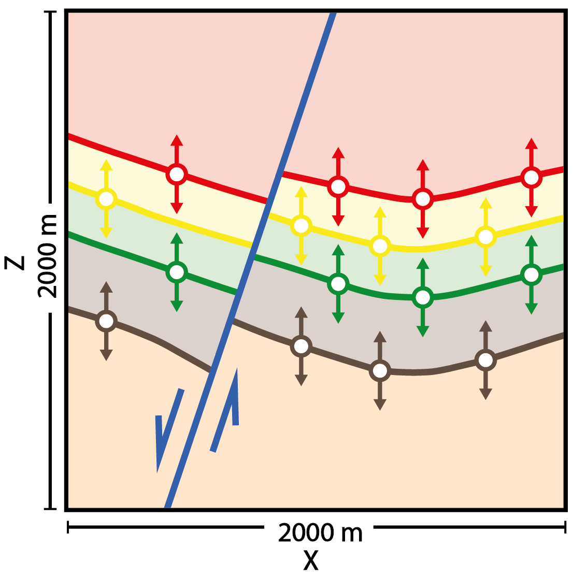
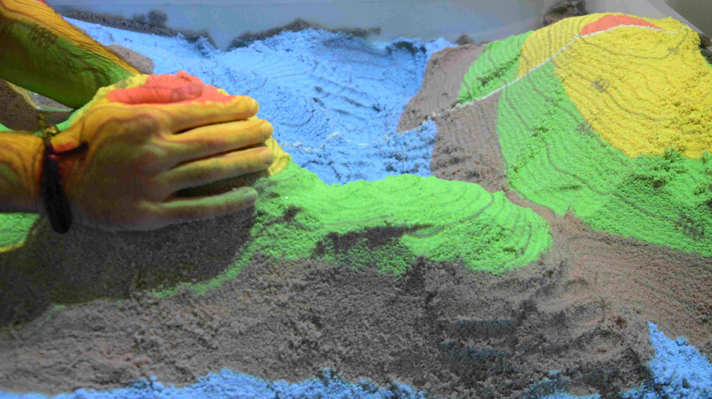
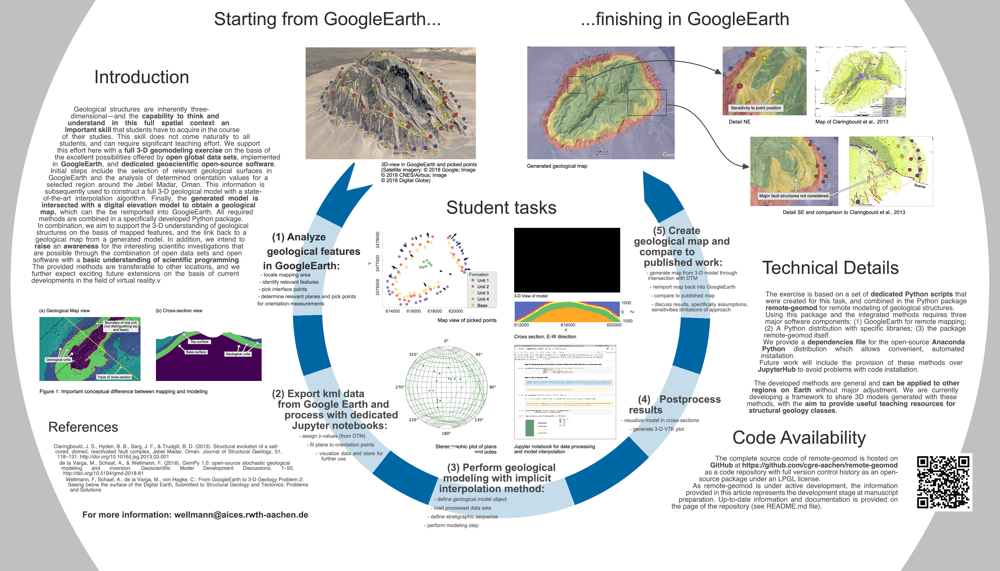

.. GeMpy documentation master file, created by
   sphinx-quickstart on Wed Dec 14 12:44:40 2016.
   You can adapt this file completely to your liking, but it should at least
   contain the root `toctree` directive.

GemPy
=====================
Software for 3D structural geologic implicit modeling in Python.
****************************************************************

.. image:: ../logos/logo_CGRE.png
   :width: 59%

GemPy is an open-source tool for generating 3D structural geological models in Python (GemPy's code can be viewed in its repository: https://github.com/cgre-aachen/gempy.). Also, check our new website https://www.gempy.org/.
It is capable of creating complex 3D geological models,
including stratigraphic and structural features such as:

- fold structures (e.g.: anticlines, synclines)
- fault networks and fault-layer interactions
- unconformities

3D models created with GemPy may look like this:

.. image:: ./images/model_example.png

Contents:

.. toctree::
   :maxdepth: 2

   self
   code
   examples/index
   about

The core algorithm of *GemPy* is based on a universal cokriging interpolation method devised by
Lajaunie et al. (1997) and extended by Calcagno et al. (2008). Its implicit nature allows the user to automatically
generate complex 3D structural geological models through the interpolation of input data:

* *Surface contact points*\ : 3D coordinates of points marking the boundaries between different features (e.g. layer interfaces, fault planes, unconformities).
* *Orientation measurements*\ : Orientation of the poles perpendicular to the dipping of surfaces at any point in the 3D space.

*GemPy* also allows for the definition of topological elements such as combining multiple stratigraphic sequences and
complex fault networks to be considered in the modeling proc

.. image:: ./images/modeling_principle.png

GemPy itself offers direct visualization of 2D sections via matplotlib
and in full 3D using the Visualization Toolkit (VTK).

.. image:: images/vtkFault.png
   :target: https://github.com/cgre-aachen/gempy.github.io/blob/master/
   :width: 70%

These VTK files can also be exported
for further processing in programs such as Paraview. GemPy can furthermore be easily
embedded in Blender for 3D rendering.
Another option is Steno3D, which allows for a flexible and interactive visualization of 3D models:

.. raw:: html

    

      <iframe src="https://steno3d.com/embed/mWACfOTPB2vT3scgJABp" width="800" height="600"></iframe>
    

*GemPy* was designed from the beginning to support stochastic geological modeling for uncertainty analysis (e.g. Monte Carlo simulations, Bayesian inference). This was achieved by writing *GemPy*\ 's core architecture
using the numerical computation library `Theano <http://deeplearning.net/software/theano/>`_ to couple it with the probabilistic programming framework `PyMC3 <https://pymc-devs.github.io/pymc3/notebooks/getting_started.html>`_.
This enables the use of advanced sampling methods (e.g. Hamiltonian Monte Carlo) and is of particular relevance when considering
uncertainties in the model input data and making use of additional secondary information in a Bayesian inference framework.

We can, for example, include uncertainties with respect to the z-position of layer boundaries
in the model space. Simple Monte Carlo simulation via PyMC will then result in different model realizations:

|z_unc| |wobble|

.. |wobble| image:: ./images/uncertainty.png
   :width: 55%

Theano allows the automated computation of gradients opening the door to the use of advanced gradient-based sampling methods
coupling *GeMpy* and `PyMC3 <https://pymc-devs.github.io/pymc3/notebooks/getting_started.html>`_ for advanced stochastic modeling.
Also, the use of Theano allows making use of GPUs through cuda (see the Theano documentation for more information.

Making use of vtk interactivity and Qgrid (https://github.com/quantopian/qgrid) *GemPy* provides a functional interface to interact with input data and models.

.. raw:: html

    

        <iframe width="560" height="315" src="https://www.youtube.com/embed/aA4MaHpLWVE?start=60" frameborder="0" allow="autoplay; encrypted-media" allowfullscreen></iframe>
    

For a more detailed elaboration of the theory behind *GemPy*\ , take a look at the upcoming scientific publication
*"GemPy 1.0: open-source stochastic geological modeling and inversion"* by de la Varga et al. (2018).

Besides the main functionality GemPy is powering currently some further projects:

Sandbox
^^^^^^^

New developments in the field of augmented reality, i.e. the superimposition of real and digital objects, offer interesting and diverse possibilities that have hardly been exploited to date.
The aim of the project is therefore the development and realization of an augmented reality sandbox for interaction with geoscientific data and models.
In this project, methods are to be developed to project geoscientific data (such as the outcrop of a geological layer surface or geophysical measurement data) onto real surfaces.

The AR Sandbox is based on a container filled with sand, the surface of which can be shaped as required. The topography of the sand surface is continuously scanned by a 3D sensor and a camera.
In the computer the scanned surface is now blended with a digital geological 3D model (or other data) in real time and an image is calculated, which is projected onto the sand surface by means
of a beamer. This results in an interactive model with which the user can interact in an intuitive way and which visualizes and comprehend complex three-dimensional facts in an accessible way.

In addition to applications in teaching and research, this development offers great potential as an interactive exhibit with high outreach for the geosciences thanks to its intuitive operation.
The finished sandbox can be used in numerous lectures and public events , but is mainly used as an interface to GemPy software and for rapid prototyping of implicit geological models.

Remote Geomod: From GoogleEarth to 3-D Geology
^^^^^^^^^^^^^^^^^^^^^^^^^^^^^^^^^^^^^^^^^^^^^^

We support this effort here with a full 3-D geomodeling exercise
on the basis of the excellent possibilities offered by open global data sets, implemented in
GoogleEarth, and dedicated geoscientific open-source software and motivate the use of 3-D
geomodeling to address specific geological questions. Initial steps include the selection of
relevant geological surfaces in GoogleEarth and the analysis of determined orientation values
for a selected region This information is subsequently used
to construct a full 3-D geological model with a state-of-the-art interpolation algorithm. Fi-
nally, the generated model is intersected with a digital elevation model to obtain a geological
map, which can then be reimported into GoogleEarth.

Getting Started
^^^^^^^^^^^^^^^

Dependecies
------------

*GemPy* requires Python 3 and makes use of numerous open-source libraries:

* pandas
* tqdm
* scikit_image
* Theano
* matplotlib
* numpy
* pytest
* scipy
* ipython
* seaborn
* setuptools
* scikit_learn
* networkx

Optional:

* ``vtk>=7`` for interactive 3-D visualization
* ``pymc`` or ``pymc3``
* ``steno3d``

Overall we recommend the use of a dedicated Python distribution, such as
`Anaconda <https://www.continuum.io/what-is-anaconda>`_\ , for hassle-free package installation.
We are curently working on providing GemPy also via Anaconda Cloud, for easier installation of
its dependencies.

Installation
-------------

We provide the latest release version of *GemPy* via the **Conda** and **PyPi** package services. We highly
recommend using either Conda or PyPi as both will take care of automatically installing all dependencies.

PyPi
~~~~

``$ pip install gempy``

Manual
~~~~~~

Otherwise you can clone the current repository by downloading is manually or by using Git by calling

``$ git clone https://github.com/cgre-aachen/gempy.git``

and then manually install it using the provided Python install file by calling

``$ python gempy/setup.py install``

in the cloned or downloaded repository folder. Make sure you have installed all necessary dependencies listed above before using *GemPy*.

Documentation
-------------

Extensive documentation for *GemPy* is hosted at `gempy.readthedocs.io <http://gempy.readthedocs.io/>`_\ ,
explaining its capabilities, `the theory behind it <http://gempy.readthedocs.io/Kriging.html>`_ and
providing detailed `tutorials <http://gempy.readthedocs.io/tutorial.html>`_ on how to use it.

References
----------

* de la Varga, M., Schaaf, A., & Wellmann, F. GemPy 1.0: open-source stochastic geological modeling and inversion.
* Calcagno, P., Chilès, J. P., Courrioux, G., & Guillen, A. (2008). Geological modelling from field data and geological knowledge: Part I. Modelling method coupling 3D potential-field interpolation and geological rules. Physics of the Earth and Planetary Interiors, 171(1-4), 147-157.
* Lajaunie, C., Courrioux, G., & Manuel, L. (1997). Foliation fields and 3D cartography in geology: principles of a method based on potential interpolation. Mathematical Geology, 29(4), 571-584.

Indices and tables
==================

* :ref:`genindex`
* :ref:`search`
