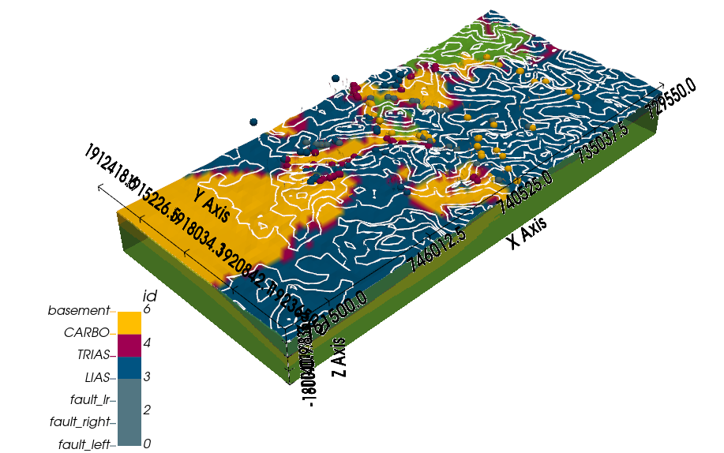
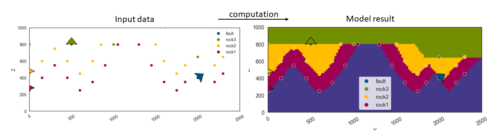
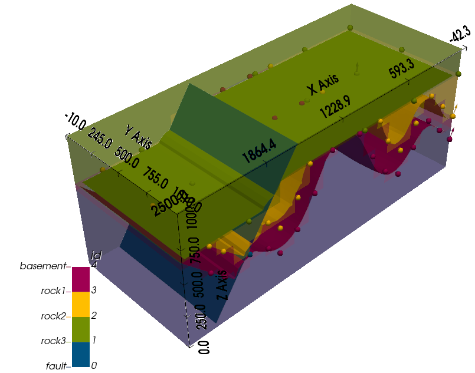
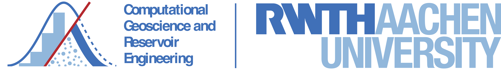
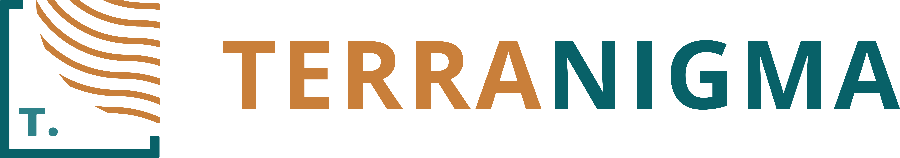

.. GeMpy documentation master file, created by
   sphinx-quickstart on Wed Dec 14 12:44:40 2016.
   You can adapt this file completely to your liking, but it should at least
   contain the root `toctree` directive.

.. ../logos/gempy1.png
   :width: 30%

About
=====
Open-source software for implicit 3D structural geological modeling in Python.
******************************************************************************

Overview
--------

``GemPy`` is a Python-based, community-driven, **open-source geomodeling library**. It is
capable of constructing complex **3D geological models** including various features such as
fold structures, fault networks and unconformities, based on an underlying
powerful **implicit** approach. From the ground up, ``GemPy`` was designed to be easily embedded in probabilistic frameworks for conducting
uncertainty analysis regarding subsurface structures.

.. Check out the documentation either in `gempy.org <https://www.gempy.org/>`_
 (better option), or `read the docs <http://gempy.readthedocs.io/>`_.

3D models created with GemPy may look like this:

Contents:

.. toctree::
   :maxdepth: 1

   self
   installation

.. toctree::
   :maxdepth: 1

   tutorials/index
   examples/index

.. toctree::
    :maxdepth: 1
    
    external/external_examples

.. toctree::
   :maxdepth: 1

   api_reference

Features
--------

Geological features
^^^^^^^^^^^^^^^^^^^

``GemPy`` is capable of modeling complex 3D geological scenarios, including:

* Multiple conformal layers (e.g. sequences of sedimentary layers)
* Several sequences of layers, with conformal continuation or unconformities
* Magmatic bodies of (almost) arbitrary shapes
* Faults (offset calculated automatically from affected geological objects)
* Full fault networks (faults affecting faults)
* Folds (affecting single layers or entire layer stacks, including overturned and recumbent folds)

Combining these elements in GemPy allows for the generation of realistic
3D geological models, on a par with most commercial geomodeling software.

Interpolation approach
^^^^^^^^^^^^^^^^^^^^^^

The generation of complex structural settings is based on the powerful
interpolation algorithm underlying ``GemPy``\ , a unviersal cokriging method
devised by `Lajaunie et al. (1997)` and extended by `Calcagno et al. (2008)`\ .
This method is used to interpolate a 3D scalar field, such that geologically
significant interfaces are isosurfces in this field.

The algorithm allows for a direct integration of two of the most relevant
geological input data types:

* **Surface contact points**\ : 3D coordinates of points marking the boundaries
  between different features (e.g. layer interfaces, fault planes, unconformities).
* **Orientation measurements**\ : Orientation of the poles perpendicular to
  the dipping of surfaces at any point in 3D space.

``GemPy`` also allows for the definition of topological elements such as
combining multiple stratigraphic sequences and
complex fault networks to be considered in the modeling process.

Integrated visualization
^^^^^^^^^^^^^^^^^^^^^^^^

Models generated with ``GemPy`` can be visualized in several ways:

* direct visualization of 2D model sections (or geological maps) using
  `matplotlib <https://matplotlib.org/stable/index.html>`_, including hillshading and other options for intuitive
  representation of results;
* 3D visualization using `Pyvista <https://www.pyvista.org>`_, including interactive plots

For a more detailed elaboration of the theory behind ``GemPy``\ , we refer to the
**open access scientific publication**\ :
`\ "GemPy 1.0: open-source stochastic geological modeling and inversion"
by de la Varga et al. (2019) <https://www.geosci-model-dev.net/12/1/2019/gmd-12-1-2019.pdf>`_.

Publications using GemPy
------------------------

- Marquetto, L., Jüstel, A., Troian, G.C., Reginato, P.A.R & Simões, J.C. (2024). `Developing a 3D hydrostratigraphical model of the emerged part of the Pelotas Basin along the northern coast of Rio Grande do Sul state, Brazil <https://link.springer.com/article/10.1007/s12665-024-11609-y>`_. Environmental Earth Sciences, 83, 329.

- Brisson, S., Wellmann, F., Chudalla, N., von Harten, J., & von Hagke, C. (2023). `Estimating uncertainties in 3-D models of complex fold-and-thrust belts: A case study of the Eastern Alps triangle zone <https://www.sciencedirect.com/science/article/pii/S2590197423000046>`_. Applied Computing and Geosciences, 18, 100115.

- Liang, Z., de la Varga, M., & Wellmann, F. (2023). `Kernel method for gravity forward simulation in implicit probabilistic geologic modeling <https://pubs.geoscienceworld.org/geophysics/article/88/3/G43/621596/Kernel-method-for-gravity-forward-simulation-in?casa_token=VjCR7rYOkKoAAAAA:W81L1AXgW_j9GiYPciBvLIdL8Zo66IzYVYiU6Ri8xLgIjbzTmpcDE74rzmAwnokX_71_XKg>`_. Geophysics, 88(3), G43-G55.

- Kong, S., Oh, J., Yoon, D., Ryu, D. W., & Kwon, H. S. (2023). `Integrating Deep Learning and Deterministic Inversion for Enhancing Fault Detection in Electrical Resistivity Surveys <https://www.mdpi.com/2076-3417/13/10/6250>`_. Applied Sciences, 13(10), 6250.

- Thomas, A. T., Micallef, A., Duan, S., & Zou, Z. (2023). `Characteristics and controls of an offshore freshened groundwater system in the Shengsi region, East China Sea <https://www.frontiersin.org/articles/10.3389/feart.2023.1198215/full>`_. Frontiers in Earth Science, 11, 1198215.

- Haehnel, P., Freund, H., Greskowiak, J., & Massmann, G. (2023). `Development of a three-dimensional hydrogeological model for the island of Norderney (Germany) using GemPy <https://doi.org/10.1002/gdj3.208>`_. Geoscience Data Journal, 00, 1–17.

- Jüstel, A., de la Varga, M., Chudalla, N., Wagner, J. D., Back, S., & Wellmann, F. (2023). `From Maps to Models-Tutorials for structural geological modeling using GemPy and GemGIS <https://jose.theoj.org/papers/10.21105/jose.00185>`_. Journal of Open Source Education, 6(66), 185.

- Thomas, A. T., von Harten, J., Jusri, T., Reiche, S., & Wellmann, F. (2022). `An integrated modeling scheme for characterizing 3D hydrogeological heterogeneity of the New Jersey shelf <https://link.springer.com/article/10.1007/s11001-022-09475-z>`_. Marine Geophysical Research, 43, 11.

- Sehsah, H., Eldosouky, A. M., & Pham, L. T. (2022). `Incremental Emplacement of the Sierra Nevada Batholith Constrained by U-Pb Ages and Potential Field Data <https://www.journals.uchicago.edu/doi/full/10.1086/722724?casa_token=pkl8XXrtyokAAAAA:YeIh1t-qwt6AT8yz_vTj4OQapaR1_nZUjS3Az_77VZXlpyfGu0cN5DSzrz6NNjoj4Qv5iud4rdc>`_. The Journal of Geology, 130(5), 381-391.

- von Harten, J., de la Varga, M., Hillier, M., & Wellmann, F. (2021). `Informed Local Smoothing in 3D Implicit Geological Modeling <https://www.mdpi.com/2075-163X/11/11/1281>`_. Minerals 2021, 11, 1281.

- Schaaf, A., de la Varga, M., Wellmann, F., & Bond, C. E. (2021). `Constraining stochastic 3-D structural geological models with topology information using approximate Bayesian computation in GemPy 2.1 <https://gmd.copernicus.org/articles/14/3899/2021/gmd-14-3899-2021.html>`_. Geosci. Model Dev., 14(6), 3899-3913. doi:10.5194/gmd-14-3899-2021.

- Güdük, N., de la Varga, M., Kaukolinna, J., & Wellmann, F. (2021). `Model-Based Probabilistic Inversion Using Magnetic Data: A Case Study on the Kevitsa Deposit <https://www.mdpi.com/2076-3263/11/4/150>`_. Geosciences, 11(4):150.

- Wu, J., & Sun, B. (2021). `Discontinuous mechanical analysis of manifold element strain of rock slope based on open source Gempy <https://www.e3s-conferences.org/articles/e3sconf/abs/2021/24/e3sconf_caes2021_03084/e3sconf_caes2021_03084.html>`_. In E3S Web of Conferences (Vol. 248, p. 03084). EDP Sciences.

- Stamm, F. A., de la Varga, M., & Wellmann, F. (2019). `Actors, actions, and uncertainties: optimizing decision-making based on 3-D structural geological models <https://se.copernicus.org/articles/10/2015/2019/se-10-2015-2019.html>`_. Solid Earth, 10, 2015–2043.

- Wellmann, F., Schaaf, A., de la Varga, M., & von Hagke, C. (2019). `From Google Earth to 3D Geology Problem 2: Seeing Below the Surface of the Digital Earth <https://www.sciencedirect.com/science/article/pii/B9780128140482000156>`_. In Developments in Structural Geology and Tectonics (Vol. 5, pp. 189-204). Elsevier.

References
----------

* de la Varga, M., Schaaf, A., and Wellmann, F.: GemPy 1.0: `open-source stochastic geological modeling and inversion,` Geosci. Model Dev., 12, 1–32, https://doi.org/10.5194/gmd-12-1-2019, 2019.
* Calcagno, P., Chilès, J. P., Courrioux, G., & Guillen, A. (2008). `Geological modelling from field data and geological knowledge: Part I. Modelling method coupling 3D potential-field interpolation and geological rules.` Physics of the Earth and Planetary Interiors, 171(1-4), 147-157.
* `Lajaunie, C., Courrioux, G., & Manuel, L. (1997). `Foliation fields and 3D cartography in geology: principles of a method based on potential interpolation.` Mathematical Geology, 29(4), 571-584.

Indices and tables
==================

* :ref:`genindex`
* :ref:`search`

